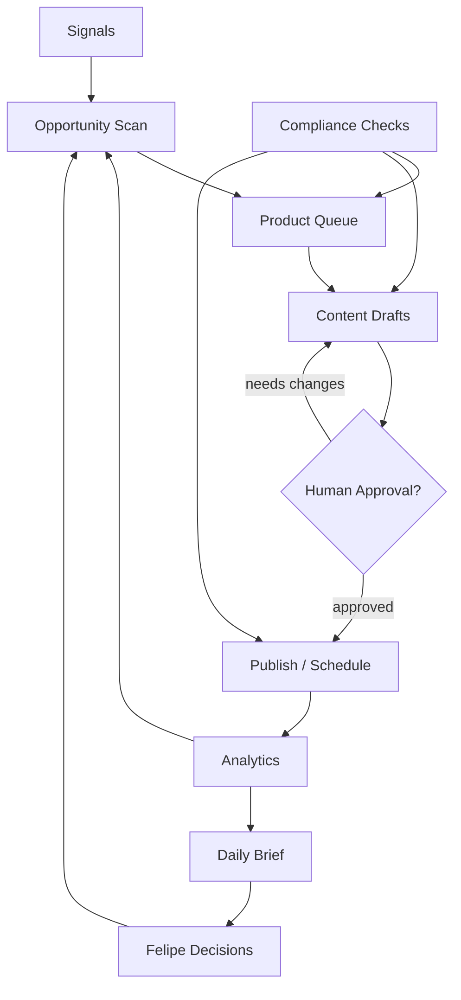

# Sladdis Store Operating Model

Purpose: make Sladdis useful as a 24/7 affiliate store agent without pretending it should publish or spend money unsupervised.

## Operating Loops

## Cadence

- Hourly: check product/link health, price or availability changes, broken pages, and obvious anomalies.
- Daily: produce one brief with opportunities, drafts waiting for approval, content performance, and blockers.
- Weekly: review categories, winner/loser content, stale drafts, and whether the store focus should shift.
- On demand: research a product/category, draft a buying guide, compare alternatives, or explain performance.

## Inputs

- Product catalog and affiliate links from actual `sladdis.store` pages or an approved live-store export.
- Amazon product foundation data: title, price, image, category, tracking link, stock status, source, and metadata.
- Store pages, content drafts, and publishing state.
- Analytics: clicks, conversions, revenue, traffic source, broken links, top pages, weak pages.
- Market signals: seasonal demand, trending products, competitor pages, search/social questions.
- Guardrails: allowed categories, forbidden claims, compliance requirements, brand voice.

Products discovered from Amazon or affiliate research are candidates only until verified against the live store. Do not import, score, brief, or draft content from inferred products as if they are active Sladdis inventory.

## Outputs

- Ranked opportunity list.
- Product queue with reason, evidence, margin/fit score, and risk notes.
- Draft buying guides, comparison snippets, social posts, email ideas, and landing page copy.
- Broken-link and stale-content alerts.
- Daily Sladdis brief with only decisions worth Felipe's attention.

## Decision Rights

Sladdis may do automatically:

- Monitor store health and analytics.
- Rank opportunities.
- Draft content.
- Suggest page updates.
- Create Agent OS tasks for internal review.
- Mark internal duplicate/stale signals when obvious.

Sladdis must ask first:

- Publish or schedule public content.
- Send external messages.
- Change affiliate account settings.
- Spend money or start paid campaigns.
- Store secrets or raw sensitive account data.
- Make compliance-sensitive claims without approval.

## Stop Conditions

Stop and ask Felipe when:

- A required credential, OAuth permission, paid service, or external account change is needed.
- Product claims touch health, finance, safety, legal, or other regulated topics.
- Analytics suggests a major category pivot.
- Automation would publish, message, buy, subscribe, or alter security settings.

## MVP Definition

The first useful version is not a fully autonomous store. It is:

1. A Supabase-backed Sladdis project and task queue.
2. A bridge/Supabase-backed affiliate storefront at `/dashboard/affiliate`.
3. An `affiliate_products` catalog with title, price, image, category, tracking link, stock status, source, and metadata.
4. A daily brief generated from safe local/read-only inputs.
5. A product/opportunity scoring model with evidence fields.
6. A draft-content pipeline with human approval before publishing.
7. Analytics feedback that feeds the next opportunity scan.

## Agent OS V1 Implementation

The bridge-backed Sladdis Storefront now exposes the first autonomous operating layer:

- `GET /affiliate/snapshot` returns products plus opportunity scoring, catalog health, compliance checks, draft candidates, an approval queue, and a daily brief.
- `POST /affiliate/products` upserts one normalized affiliate product.
- `POST /affiliate/products/batch` imports a feed batch and reports per-row failures without aborting the full batch. It accepts `{ products }`, `{ items }`, or a root array, plus optional `defaults`, `source`, and `batchId` metadata.
- `POST /affiliate/stats` upserts one daily analytics row for clicks, conversions, revenue, commission, conversion rate, and optional content/ranking rows in `topProducts`.
- `POST /affiliate/stats/batch` imports a stats batch and reports per-row failures without aborting the full batch. It accepts `{ rows }`, `{ stats }`, or a root array, plus optional `defaults`.

Product ingestion normalizes common feed aliases such as `asin`, `sku`, `name`, `image`, `affiliateUrl`, `trackingUrl`, `department`, and `browseNode`. Rows without explicit IDs get stable affiliate product IDs from source product IDs or tracking links, so repeated feed imports update existing products instead of creating duplicates. Product scoring uses metadata when present (`commissionRate`, `discountPercent`, `trendScore`, `seasonality`, `conversionLikelihood`, `contentFit`) and falls back to catalog quality, rating/review count, stock, price, and tracking-link completeness. Scores include evidence and rejection reasons so Sladdis can show why an item is ready, watchlisted, or needs review.

Catalog health is read-only. It checks missing prices, missing/invalid images, missing categories, unknown/out-of-stock products, missing/invalid tracking links, stale prices, duplicate products, weak metadata, and missing live-store verification. Problems become a repair queue with suggested fixes; Sladdis must not silently rewrite the store catalog. Unverified products may stay visible as repair candidates, but they are excluded from opportunity scoring, draft generation, approvals, and daily-brief top picks until verified against `sladdis.store` or an approved live-store export.

Publishing remains approval-gated. The UI surfaces opportunity queues, scoring evidence, catalog health, drafts, approvals, compliance warnings, stop-condition style blockers, and suggested next actions so Sladdis does not run important loops invisibly.

Analytics feedback is also read-only in V1. Imported daily stats produce 7-day clicks, conversions, revenue, commission, conversion rate, CTR, content performance, ranking-change rows, and a suggested next action. Sladdis should use those signals to decide what to inspect next, not to auto-publish or auto-spend.
