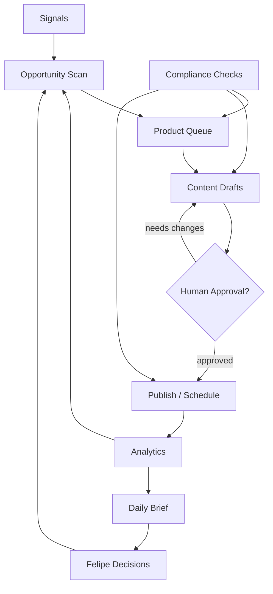

# Sladdis Store Operating Model

Purpose: make Sladdis useful as a 24/7 affiliate store agent without pretending it should publish or spend money unsupervised.

## Operating Loops

## Cadence

- Hourly: check product/link health, price or availability changes, broken pages, and obvious anomalies.
- Daily: produce one brief with opportunities, drafts waiting for approval, content performance, and blockers.
- Weekly: review categories, winner/loser content, stale drafts, and whether the store focus should shift.
- On demand: research a product/category, draft a buying guide, compare alternatives, or explain performance.

## Inputs

- Product catalog and affiliate links.
- Amazon product foundation data: title, price, image, category, tracking link, stock status, source, and metadata.
- Store pages, content drafts, and publishing state.
- Analytics: clicks, conversions, revenue, traffic source, broken links, top pages, weak pages.
- Market signals: seasonal demand, trending products, competitor pages, search/social questions.
- Guardrails: allowed categories, forbidden claims, compliance requirements, brand voice.

## Outputs

- Ranked opportunity list.
- Product queue with reason, evidence, margin/fit score, and risk notes.
- Draft buying guides, comparison snippets, social posts, email ideas, and landing page copy.
- Broken-link and stale-content alerts.
- Daily Sladdis brief with only decisions worth Felipe's attention.

## Decision Rights

Sladdis may do automatically:

- Monitor store health and analytics.
- Rank opportunities.
- Draft content.
- Suggest page updates.
- Create Agent OS tasks for internal review.
- Mark internal duplicate/stale signals when obvious.

Sladdis must ask first:

- Publish or schedule public content.
- Send external messages.
- Change affiliate account settings.
- Spend money or start paid campaigns.
- Store secrets or raw sensitive account data.
- Make compliance-sensitive claims without approval.

## Stop Conditions

Stop and ask Felipe when:

- A required credential, OAuth permission, paid service, or external account change is needed.
- Product claims touch health, finance, safety, legal, or other regulated topics.
- Analytics suggests a major category pivot.
- Automation would publish, message, buy, subscribe, or alter security settings.

## MVP Definition

The first useful version is not a fully autonomous store. It is:

1. A Supabase-backed Sladdis project and task queue.
2. A bridge/Supabase-backed affiliate storefront at `/dashboard/affiliate`.
3. An `affiliate_products` catalog with title, price, image, category, tracking link, stock status, source, and metadata.
4. A daily brief generated from safe local/read-only inputs.
5. A product/opportunity scoring model with evidence fields.
6. A draft-content pipeline with human approval before publishing.
7. Analytics feedback that feeds the next opportunity scan.
