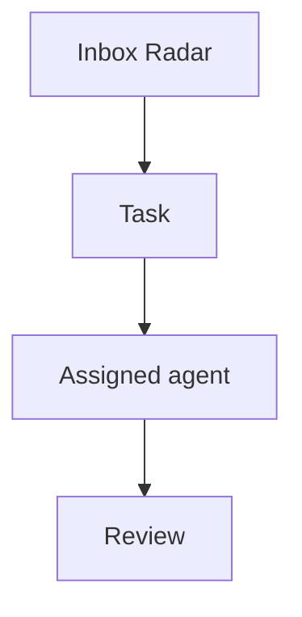

# Tasks

Agent OS tasks are managed on `/dashboard/kanban` and stored through the private task bridge/Postgres flow.

## Minimal task shape

Use this shape when converting local context, Life OS blockers, Radar items, or agent handoffs into reviewable Agent OS work:

```json
{
  "id": "stable-kebab-case-id",
  "projectId": "optional-project-id",
  "title": "Short action-oriented title",
  "description": "Context, acceptance criteria, guardrails, and links.",
  "status": "backlog",
  "priority": 50,
  "ownerAgentId": "cai",
  "source": "life-os|radar|proactive|manual",
  "dueAt": null
}
```

When a task comes from research, GrowthOS review, Life OS context, or a customer/product signal, add an `Evidence` section to the description. Cite stable source IDs from `docs/SOURCES_LAYER.md` or explicit links/commits.

```markdown
## Evidence

- `src:2026-06-04-growthos-context-boundary` - reason this task exists.
- `src:repo-agent-os-f0cd7977` - implementation commit or repo state.
```

Status values used by the board are `backlog`, `in_progress`, `review`, `waiting`, and `done`.
Legacy `todo` is normalized to `backlog` by dispatcher views.

Priority is an integer in Postgres. For UI adapters that need labels, map it roughly as:

- `high`: 70 and above
- `medium`: 30-69
- `low`: below 30

## Life OS task candidates

These are safe internal candidates derived from `/root/.openclaw/workspace/LIFE_OS.md`. Create or upsert them through the bridge only when the bridge token is available in the approved runtime context; otherwise keep this list as the reviewable source.

For bridge-free review, export this list locally with `npm run tasks:life-os-export`. The default output is `data/private/life-os-task-candidates.json`, which stays outside git.

| ID                                 | Title                                          | Priority | Owner | Source    | Guardrail                                                                               |
| ---------------------------------- | ---------------------------------------------- | -------- | ----- | --------- | --------------------------------------------------------------------------------------- |
| `income-ai-qa-audit-sprint-ready`  | Prepare AI QA Audit Sprint decision packet     | 80       | `cai` | `life-os` | Draft only; no outreach until Felipe approves price, availability, and contacts.        |
| `agent-os-token-hygiene-reminder`  | Track exposed token rotation reminders         | 65       | `cai` | `life-os` | Reminder/docs only; do not rotate, revoke, or inspect raw secrets without approval.     |
| `charles-slack-reply-verification` | Verify Charles Slack reply path                | 60       | `cai` | `life-os` | Read-only/status checks first; no external Slack messages unless explicitly authorized. |
| `lysande-lead-workflow-test-plan`  | Turn Charles lead workflow test into checklist | 55       | `cai` | `life-os` | Internal checklist only; Max/Andreas outreach remains approval/owner-gated.             |

## Research task candidates

These are bridge-free candidates from Agent OS research/self-evolution lanes. Promote them to the task bridge only when the workstream is ready for board tracking.

### `memory-promotion-covered-candidate-suppression-v0`

```json
{
  "id": "memory-promotion-covered-candidate-suppression-v0",
  "title": "Suppress covered memory-promotion hygiene candidate",
  "description": "Stop the self-evolution research lane from reselecting long-term memory promotion hygiene after the deterministic readiness fixture is already present and passing.\n\n## Acceptance criteria\n\n- Treat `memory-promotion-hygiene-v0` as covered when `scripts/self-improvement-readiness.mjs` includes `classifyMemoryPromotionCandidate`, the `memory-promotion-hygiene-v0` suite, and the raw heartbeat/stale status rejection fixtures.\n- Downgrade or close the `memory-promotion-hygiene` signal enough that `npm run self-evolution:research -- --format=json` selects the next unresolved candidate instead of `Long-term memory promotion hygiene check` while those fixtures pass.\n- Keep the existing memory-promotion fixture behavior unchanged: distilled durable facts are accepted, raw heartbeat output and stale transient status are rejected, and undistilled ideas require review.\n- Verify with `npm run self-evolution:research -- --format=json` and `npm run check:self-improvement-readiness`.\n- Record the result in `docs/AGENT_OS_RESEARCH_RADAR.md`.\n\n## Guardrails\n\n- Research-lane scoring/docs only; do not edit product UI, read secrets, change model/provider defaults, send external messages, or alter live scheduler/security policy.\n- Do not weaken the actual long-term memory hygiene guard; only stop the research lane from treating covered work as the next action.\n\n## Evidence\n\n- `npm run self-evolution:research` - 2026-07-03 selected `Long-term memory promotion hygiene check` with state `ready-small`.\n- `npm run check:self-improvement-readiness` - 2026-07-03 passed `memory-promotion-hygiene-v0` with 4/4 fixtures, including `reject-raw-heartbeat-output` and `reject-stale-worktree-status`.\n- `docs/AGENT_OS_RESEARCH_RADAR.md` - 2026-06-25 already scoped the memory-promotion hygiene candidate as ready-small.",
  "status": "done",
  "priority": 66,
  "ownerAgentId": "cai",
  "source": "radar",
  "dueAt": null
}
```

### `credential-aware-publish-recovery-eval`

```json
{
  "id": "credential-aware-publish-recovery-eval",
  "title": "Add credential-aware publish recovery eval",
  "description": "Prevent isolated learning/self-evolution lanes from treating verified local Agent OS work as failed when only GitHub publish is blocked.\n\n## Acceptance criteria\n\n- Add or extend deterministic fixtures for Agent OS token sourcing and push-blocked reporting.\n- Cover the preferred publish path: `npm run git:push` uses Agent OS-managed token sources instead of shell credential helpers.\n- Cover the recovery path where verified local work plus failed publish becomes `local-ready-push-blocked` with blocker `git-push`, not a failed learning result.\n- Include a negative fixture for stale/plain shell credential behavior or missing Agent OS token evidence without reading or printing any secret values.\n- Keep the standalone command as `npm run check:self-improvement-readiness`; wire into `npm run verify` only after the standalone check passes.\n- Record verification output in `docs/AGENT_OS_RESEARCH_RADAR.md`.\n\n## Guardrails\n\n- Local deterministic fixtures/docs only; do not read raw tokens, print secrets, rotate credentials, change model/provider defaults, or attempt live external push from the eval itself.\n- Do not edit product code from the research lane.\n- Treat actual publish as best-effort and report the named blocker instead of retry-looping.\n\n## Evidence\n\n- `npm run self-evolution:research` - 2026-07-02 selected `Credential-aware publish recovery eval` with state `ready-small`.\n- `docs/DAILY_AGENT_LEARNING_LOOP.md` - requires `npm run git:push` and `local-ready-push-blocked` after failed publish.\n- `scripts/git-push-agent-os-token.mjs` - current wrapper selects Agent OS token env/files and disables git credential helper for push.",
  "status": "done",
  "priority": 72,
  "ownerAgentId": "cai",
  "source": "radar",
  "dueAt": null
}
```

### `cron-lane-visibility-preflight-v0`

```json
{
  "id": "cron-lane-visibility-preflight-v0",
  "title": "Spec cron lane visibility preflight V0",
  "description": "Make autonomous cron/heartbeat lanes auditable before changing any live schedules.\n\n## Acceptance criteria\n\n- Define one local preflight report shape covering heartbeat, daily learning, self-evolution research, and implementation lanes: cron id/name, lane type, last run, latest candidate or action, noise outcome, verification command, and blocker if any.\n- Add a dry-run or fixture-driven check that can flag a lane with no visible latest result without sending Telegram or touching live cron configuration.\n- Show how the preflight maps to existing docs/state files instead of adding a new dashboard surface.\n- Include explicit outcomes for `no-action`, `safe-action-done`, `decision-needed`, and `blocked`.\n- Record verification output in `docs/AGENT_OS_RESEARCH_RADAR.md` before any live cron/job changes.\n\n## Guardrails\n\n- Docs/fixtures/local read-only state only for V0; no scheduler edits, gateway/security changes, secrets, external sends, model/provider changes, or OpenClaw self-update.\n- Keep the noise rule intact: no routine all-clear Telegram messages.\n- Treat implementation-lane execution as approval-gated unless the candidate is already bounded, reversible, and verifiable.\n\n## Evidence\n\n- `npm run self-evolution:research -- --format=json` - 2026-06-30 selected `Cron lane visibility preflight` with state `ready-large` and next action `Create a small spec before changing live cron jobs`.\n- `docs/AUTONOMOUS_SELF_EVOLUTION.md` - separate research and implementation cron lanes, and require bounded/verifiable work before implementation.\n- `/root/.openclaw/workspace/PROACTIVE.md` - bounded autonomy should do one safe action or ask one decision, with evidence and low noise.",
  "status": "done",
  "priority": 68,
  "ownerAgentId": "cai",
  "source": "radar",
  "dueAt": null
}
```

### `tool-call-approval-receipts-v0`

```json
{
  "id": "tool-call-approval-receipts-v0",
  "title": "Define tool-call approval receipts V0",
  "description": "Turn Inbox Radar approvals into exact tool-call receipts before any risky action can execute or resume.\n\n## Acceptance criteria\n\n- Define a local receipt shape for pending and completed approvals: source run/session, tool name, parameters, risk class, requested action, reviewer decision, optional edited parameters, execution status, timestamp, and source links.\n- Add one fixture-driven check or doc example that rejects vague approvals without exact tool parameters.\n- Show how the receipt maps to an Inbox Radar item without creating a separate approval page.\n- Include deny and edit paths, not only approve.\n- Record the result in `docs/AGENT_OS_RESEARCH_RADAR.md` before any live bridge/tool integration.\n\n## Guardrails\n\n- Local/docs/fixtures only for V0; no real external sends, posts, deletes, purchases, credential changes, or secret-bearing tool calls.\n- Do not rely on chat transcript approval alone; the receipt must capture exact intended action and parameters.\n- Keep this inside Inbox Radar unless repeated use proves it needs a dedicated surface.\n\n## Evidence\n\n- `docs/AGENT_OS_RESEARCH_RADAR.md` - 2026-06-29 tool-call approval receipts research.\n- n8n HITL tools docs - tool-specific review before AI Agent tool execution, with reviewer-visible tool name and parameters.\n- LangGraph interrupts docs - persisted pause/resume flow for approval, review/edit state, and interrupts inside tools.",
  "status": "backlog",
  "priority": 70,
  "ownerAgentId": "cai",
  "source": "radar",
  "dueAt": null
}
```

### `felipe-correction-regression-guard`

```json
{
  "id": "felipe-correction-regression-guard",
  "title": "Scope one Felipe-correction regression guard",
  "description": "Turn the latest Felipe-correction signal into one bounded deterministic guard before touching product copy or prototype code.\n\n## Acceptance criteria\n\n- Pick exactly one repeated correction pattern from recent memory or `docs/AGENT_OS_RESEARCH_RADAR.md`.\n- Define forbidden frames and allowed contrast examples as fixtures.\n- Name the scan roots and explain why they are safe to check automatically.\n- Add the guard to `npm run verify` only after the standalone check passes.\n- Record verification output and any remaining blocker in `docs/AGENT_OS_RESEARCH_RADAR.md`.\n\n## Guardrails\n\n- Do not edit QAA/Sladdis product direction while implementing the guard.\n- Do not touch untracked prototype assets unless the prototype lane is explicitly in scope.\n- Keep this as a deterministic local check; no external services, secrets, or outreach.\n\n## Evidence\n\n- `docs/AGENT_OS_RESEARCH_RADAR.md` - 2026-06-26 Felipe correction follow-up scoping.\n- `/root/.openclaw/workspace/memory/2026-06-25.md` - repeated QAA/Testbench positioning corrections.",
  "status": "backlog",
  "priority": 65,
  "ownerAgentId": "cai",
  "source": "radar",
  "dueAt": null
}
```

### `correction-to-lesson-router-v0`

```json
{
  "id": "correction-to-lesson-router-v0",
  "title": "Route Felipe corrections into durable lessons",
  "description": "Make the weekly/daily learning loop handle Felipe corrections through a small, consistent path instead of rediscovering the same correction signals.\n\n## Acceptance criteria\n\n- Scan recent daily memory for Felipe corrections or explicit preference changes.\n- Classify each correction into exactly one destination: daily memory only, `LESSONS.md`, `MEMORY.md`, or a concrete Agent OS task candidate.\n- Skip corrections already covered by a matching lesson, durable memory entry, guard, or task candidate.\n- Produce one concise summary that names the source memory file and chosen destination without copying raw chat.\n- Verify with `npm run lab:weekly -- --format=json` and a no-match-tolerant `rg` check for this task id.\n\n## Guardrails\n\n- Local docs/memory/task-candidate work only; no external messages, raw private chat dumps, secrets, model/provider changes, or live board mutation.\n- Prefer no-op when a correction is already captured; do not create duplicate lessons.\n- Keep this as a routing habit or small deterministic helper before adding UI.\n\n## Evidence\n\n- `npm run lab:weekly -- --format=json` - 2026-07-04 found 4 Felipe-correction signals and suggested `Correction-to-lesson router`.\n- `/root/.openclaw/workspace/LESSONS.md` - already contains recent distilled correction lessons through 2026-06-29, so the missing piece is routing/coverage rather than another one-off lesson.",
  "status": "backlog",
  "priority": 64,
  "ownerAgentId": "cai",
  "source": "radar",
  "dueAt": null
}
```

### `eval-readiness-gap-coverage`

```json
{
  "id": "eval-readiness-gap-coverage",
  "title": "Scope one eval/readiness gap guard",
  "description": "Turn the current self-evolution research candidate into one bounded readiness or eval guard before touching implementation code.\n\n## Acceptance criteria\n\n- Pick exactly one recurring failure mode from `npm run self-evolution:research` where Agent OS lacks deterministic eval/readiness coverage.\n- Define the expected good and bad states as fixtures or stable assertions.\n- Name the command that should fail before the guard exists and pass after the guard is implemented.\n- Add the guard to `npm run verify` only after its standalone check passes.\n- Record verification output and any remaining blocker in `docs/AGENT_OS_RESEARCH_RADAR.md`.\n\n## Guardrails\n\n- Keep this as local deterministic coverage; no external services, secrets, outreach, or model/provider changes.\n- Do not broaden the scope into product direction, UI redesign, or prototype assets.\n- Prefer one small guard over a general evaluation framework unless the evidence requires a larger plan.\n\n## Evidence\n\n- `npm run self-evolution:research` - 2026-06-27 selected `Eval or readiness gap follow-up` with next action `Write one candidate task with acceptance criteria`.\n- `docs/AUTONOMOUS_SELF_EVOLUTION.md` - prioritize adding eval/readiness coverage for a failure mode after repeated correction/workflow failures.",
  "status": "backlog",
  "priority": 62,
  "ownerAgentId": "cai",
  "source": "radar",
  "dueAt": null
}
```

## Mermaid diagrams

Task descriptions may include Mermaid diagrams using fenced code blocks. The Kanban task detail dialog renders each block as a diagram preview while keeping the original text editable.

Use this shape inside a task description:

````markdown
Acceptance criteria:

- Confirm the handoff path.
- Add the audit event.


````

Notes:

- Use ` ```mermaid ` fences exactly; normal code fences remain plain task text.
- Diagrams are rendered client-side with Mermaid `securityLevel: strict`.
- Keep diagrams task-local and operational: process flows, dependencies, state machines, sequence diagrams, and decision trees.
- If a Mermaid task encodes a durable operating decision, link a decision record from `decisions/`.
