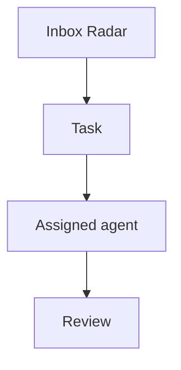

# Tasks

Agent OS tasks are managed on `/dashboard/kanban` and stored through the private task bridge/Postgres flow.

## Mermaid diagrams

Task descriptions may include Mermaid diagrams using fenced code blocks. The Kanban task detail dialog renders each block as a diagram preview while keeping the original text editable.

Use this shape inside a task description:

````markdown
Acceptance criteria:

- Confirm the handoff path.
- Add the audit event.


````

Notes:

- Use ` ```mermaid ` fences exactly; normal code fences remain plain task text.
- Diagrams are rendered client-side with Mermaid `securityLevel: strict`.
- Keep diagrams task-local and operational: process flows, dependencies, state machines, sequence diagrams, and decision trees.
