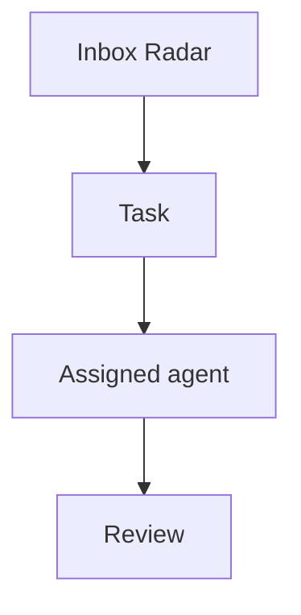

# Tasks

Agent OS tasks are managed on `/dashboard/kanban` and stored through the private task bridge/Postgres flow.

## Minimal task shape

Use this shape when converting local context, Life OS blockers, Radar items, or agent handoffs into reviewable Agent OS work:

```json
{
  "id": "stable-kebab-case-id",
  "projectId": "optional-project-id",
  "title": "Short action-oriented title",
  "description": "Context, acceptance criteria, guardrails, and links.",
  "status": "backlog",
  "priority": 50,
  "ownerAgentId": "cai",
  "source": "life-os|radar|proactive|manual",
  "dueAt": null
}
```

When a task comes from research, GrowthOS review, Life OS context, or a customer/product signal, add an `Evidence` section to the description. Cite stable source IDs from `docs/SOURCES_LAYER.md` or explicit links/commits.

```markdown
## Evidence

- `src:2026-06-04-growthos-context-boundary` - reason this task exists.
- `src:repo-agent-os-f0cd7977` - implementation commit or repo state.
```

Status values used by the board are `backlog`, `in_progress`, `review`, `waiting`, and `done`.
Legacy `todo` is normalized to `backlog` by dispatcher views.

Priority is an integer in Postgres. For UI adapters that need labels, map it roughly as:

- `high`: 70 and above
- `medium`: 30-69
- `low`: below 30

## Life OS task candidates

These are safe internal candidates derived from `/root/.openclaw/workspace/LIFE_OS.md`. Create or upsert them through the bridge only when the bridge token is available in the approved runtime context; otherwise keep this list as the reviewable source.

| ID | Title | Priority | Owner | Source | Guardrail |
| --- | --- | --- | --- | --- | --- |
| `income-ai-qa-audit-sprint-ready` | Prepare AI QA Audit Sprint decision packet | 80 | `cai` | `life-os` | Draft only; no outreach until Felipe approves price, availability, and contacts. |
| `agent-os-token-hygiene-reminder` | Track exposed token rotation reminders | 65 | `cai` | `life-os` | Reminder/docs only; do not rotate, revoke, or inspect raw secrets without approval. |
| `charles-slack-reply-verification` | Verify Charles Slack reply path | 60 | `cai` | `life-os` | Read-only/status checks first; no external Slack messages unless explicitly authorized. |
| `lysande-lead-workflow-test-plan` | Turn Charles lead workflow test into checklist | 55 | `cai` | `life-os` | Internal checklist only; Max/Andreas outreach remains approval/owner-gated. |

## Mermaid diagrams

Task descriptions may include Mermaid diagrams using fenced code blocks. The Kanban task detail dialog renders each block as a diagram preview while keeping the original text editable.

Use this shape inside a task description:

````markdown
Acceptance criteria:

- Confirm the handoff path.
- Add the audit event.


````

Notes:

- Use ` ```mermaid ` fences exactly; normal code fences remain plain task text.
- Diagrams are rendered client-side with Mermaid `securityLevel: strict`.
- Keep diagrams task-local and operational: process flows, dependencies, state machines, sequence diagrams, and decision trees.
- If a Mermaid task encodes a durable operating decision, link a decision record from `decisions/`.
