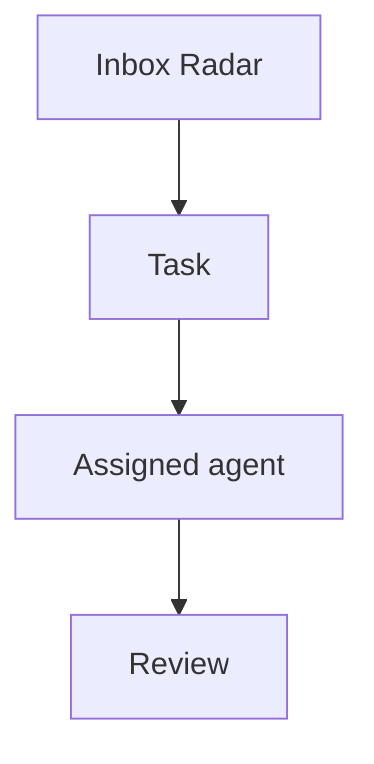

# Tasks

Agent OS tasks are managed on `/dashboard/kanban` and stored through the private task bridge/Postgres flow.

## Minimal task shape

Use this shape when converting local context, Life OS blockers, Radar items, or agent handoffs into reviewable Agent OS work:

```json
{
  "id": "stable-kebab-case-id",
  "projectId": "optional-project-id",
  "title": "Short action-oriented title",
  "description": "Context, acceptance criteria, guardrails, and links.",
  "status": "backlog",
  "priority": 50,
  "ownerAgentId": "cai",
  "source": "life-os|radar|proactive|manual",
  "dueAt": null
}
```

When a task comes from research, GrowthOS review, Life OS context, or a customer/product signal, add an `Evidence` section to the description. Cite stable source IDs from `docs/SOURCES_LAYER.md` or explicit links/commits.

```markdown
## Evidence

- `src:2026-06-04-growthos-context-boundary` - reason this task exists.
- `src:repo-agent-os-f0cd7977` - implementation commit or repo state.
```

Status values used by the board are `backlog`, `in_progress`, `review`, `waiting`, and `done`.
Legacy `todo` is normalized to `backlog` by dispatcher views.

Priority is an integer in Postgres. For UI adapters that need labels, map it roughly as:

- `high`: 70 and above
- `medium`: 30-69
- `low`: below 30

## Life OS task candidates

These are safe internal candidates derived from `/root/.openclaw/workspace/LIFE_OS.md`. Create or upsert them through the bridge only when the bridge token is available in the approved runtime context; otherwise keep this list as the reviewable source.

For bridge-free review, export this list locally with `npm run tasks:life-os-export`. The default output is `data/private/life-os-task-candidates.json`, which stays outside git.

| ID                                 | Title                                          | Priority | Owner | Source    | Guardrail                                                                               |
| ---------------------------------- | ---------------------------------------------- | -------- | ----- | --------- | --------------------------------------------------------------------------------------- |
| `income-ai-qa-audit-sprint-ready`  | Prepare AI QA Audit Sprint decision packet     | 80       | `cai` | `life-os` | Draft only; no outreach until Felipe approves price, availability, and contacts.        |
| `agent-os-token-hygiene-reminder`  | Track exposed token rotation reminders         | 65       | `cai` | `life-os` | Reminder/docs only; do not rotate, revoke, or inspect raw secrets without approval.     |
| `charles-slack-reply-verification` | Verify Charles Slack reply path                | 60       | `cai` | `life-os` | Read-only/status checks first; no external Slack messages unless explicitly authorized. |
| `lysande-lead-workflow-test-plan`  | Turn Charles lead workflow test into checklist | 55       | `cai` | `life-os` | Internal checklist only; Max/Andreas outreach remains approval/owner-gated.             |

## Research task candidates

These are bridge-free candidates from Agent OS research/self-evolution lanes. Promote them to the task bridge only when the workstream is ready for board tracking.

### `felipe-correction-regression-guard`

```json
{
  "id": "felipe-correction-regression-guard",
  "title": "Scope one Felipe-correction regression guard",
  "description": "Turn the latest Felipe-correction signal into one bounded deterministic guard before touching product copy or prototype code.\n\n## Acceptance criteria\n\n- Pick exactly one repeated correction pattern from recent memory or `docs/AGENT_OS_RESEARCH_RADAR.md`.\n- Define forbidden frames and allowed contrast examples as fixtures.\n- Name the scan roots and explain why they are safe to check automatically.\n- Add the guard to `npm run verify` only after the standalone check passes.\n- Record verification output and any remaining blocker in `docs/AGENT_OS_RESEARCH_RADAR.md`.\n\n## Guardrails\n\n- Do not edit QAA/Sladdis product direction while implementing the guard.\n- Do not touch untracked prototype assets unless the prototype lane is explicitly in scope.\n- Keep this as a deterministic local check; no external services, secrets, or outreach.\n\n## Evidence\n\n- `docs/AGENT_OS_RESEARCH_RADAR.md` - 2026-06-26 Felipe correction follow-up scoping.\n- `/root/.openclaw/workspace/memory/2026-06-25.md` - repeated QAA/Testbench positioning corrections.",
  "status": "backlog",
  "priority": 65,
  "ownerAgentId": "cai",
  "source": "radar",
  "dueAt": null
}
```

### `eval-readiness-gap-coverage`

```json
{
  "id": "eval-readiness-gap-coverage",
  "title": "Scope one eval/readiness gap guard",
  "description": "Turn the current self-evolution research candidate into one bounded readiness or eval guard before touching implementation code.\n\n## Acceptance criteria\n\n- Pick exactly one recurring failure mode from `npm run self-evolution:research` where Agent OS lacks deterministic eval/readiness coverage.\n- Define the expected good and bad states as fixtures or stable assertions.\n- Name the command that should fail before the guard exists and pass after the guard is implemented.\n- Add the guard to `npm run verify` only after its standalone check passes.\n- Record verification output and any remaining blocker in `docs/AGENT_OS_RESEARCH_RADAR.md`.\n\n## Guardrails\n\n- Keep this as local deterministic coverage; no external services, secrets, outreach, or model/provider changes.\n- Do not broaden the scope into product direction, UI redesign, or prototype assets.\n- Prefer one small guard over a general evaluation framework unless the evidence requires a larger plan.\n\n## Evidence\n\n- `npm run self-evolution:research` - 2026-06-27 selected `Eval or readiness gap follow-up` with next action `Write one candidate task with acceptance criteria`.\n- `docs/AUTONOMOUS_SELF_EVOLUTION.md` - prioritize adding eval/readiness coverage for a failure mode after repeated correction/workflow failures.",
  "status": "backlog",
  "priority": 62,
  "ownerAgentId": "cai",
  "source": "radar",
  "dueAt": null
}
```

## Mermaid diagrams

Task descriptions may include Mermaid diagrams using fenced code blocks. The Kanban task detail dialog renders each block as a diagram preview while keeping the original text editable.

Use this shape inside a task description:

````markdown
Acceptance criteria:

- Confirm the handoff path.
- Add the audit event.


````

Notes:

- Use ` ```mermaid ` fences exactly; normal code fences remain plain task text.
- Diagrams are rendered client-side with Mermaid `securityLevel: strict`.
- Keep diagrams task-local and operational: process flows, dependencies, state machines, sequence diagrams, and decision trees.
- If a Mermaid task encodes a durable operating decision, link a decision record from `decisions/`.
